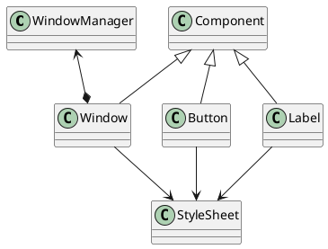

Design
=====

## Component
It is a abstract base class for all other gui components
Implements basic objects suppport with childs aggregation and it's lifetime management
as well as some basic position and size control

## Window
Implements simple closable window (managed by WindowManager). It can contain any `Component` 

Possible / target implementation:

## Button
Simple button class that can have `onClick` method bind to user action. 

## Label
Class for creating text labels

## WindowManager
Manages `Window` instances (added to given window manager) with Z-ordering, focusing and destroying dead windows.

## Stylesheet
Describes visual theme of components

# Dependencies

Rough sketch of dependencies

