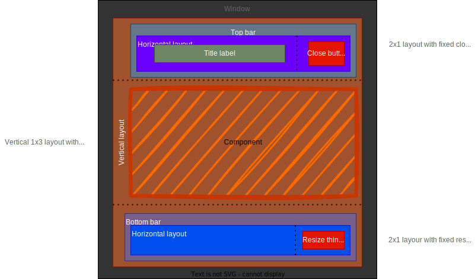

Design
=====

- [Design](#design)
  - [Component](#component)
  - [Window](#window)
  - [Button](#button)
  - [Label](#label)
  - [WindowManager](#windowmanager)
  - [Stylesheet](#stylesheet)
- [Dependencies](#dependencies)
- [Drawing](#drawing)
- [Event processing](#event-processing)

## Component
It is a abstract base class for all other gui components
Implements basic objects suppport with childs aggregation and it's lifetime management
as well as some basic position and size control

## Window
Implements simple closable window (managed by WindowManager). It can contain any `Component` 

Possible / target implementation:

## Button
Simple button class that can have `onClick` method bind to user action. 

## Label
Class for creating text labels

## WindowManager
Manages `Window` instances (added to given window manager) with Z-ordering, focusing and destroying dead windows.

## Stylesheet
Describes visual theme of components

# Dependencies

Rough sketch of dependencies

# Drawing
Currently components draw themselve on sfml render target.
Consider moving it to separate texture and redraw those only when needed to boost performance.

# Event processing

There is a hierarchy how mouse events are beeing processed.
If user clicks on given component it iterates over all its children to check if any of them captures the event. If captured, event is not processed further. If any child has not captured the event, event is processed with component itself.